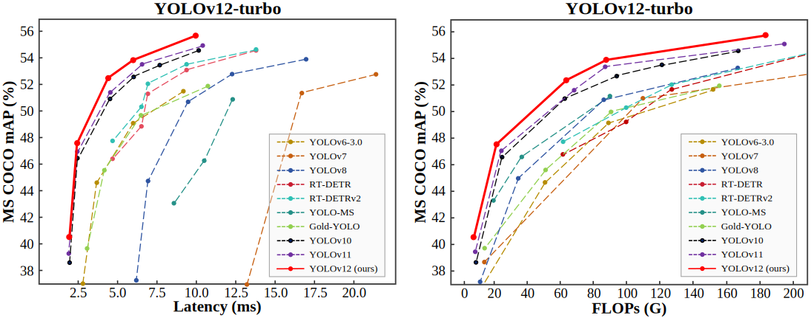

<div align="center">
<h1>YOLOv12</h1>
<h3>YOLOv12: Attention-Centric Real-Time Object Detectors</h3>

[Yunjie Tian](https://sunsmarterjie.github.io/)<sup>1</sup>, [Qixiang Ye](https://people.ucas.ac.cn/~qxye?language=en)<sup>2</sup>, [David Doermann](https://cse.buffalo.edu/~doermann/)<sup>1</sup>

<sup>1</sup>  University at Buffalo, SUNY, <sup>2</sup> University of Chinese Academy of Sciences.


<p align="center">
   <br>
  Comparison with popular methods in terms of latency-accuracy (left) and FLOPs-accuracy (right) trade-offs
</p>

</div>

[](https://arxiv.org/abs/2502.12524) [](https://huggingface.co/spaces/sunsmarterjieleaf/yolov12) <a href="https://colab.research.google.com/github/roboflow-ai/notebooks/blob/main/notebooks/train-yolov12-object-detection-model.ipynb"></a> [](https://www.kaggle.com/code/jxxn03x/yolov12-on-custom-data) [](https://colab.research.google.com/github/lightly-ai/lightly-train/blob/main/examples/notebooks/yolov12.ipynb) [](https://blog.roboflow.com/use-yolov12-with-roboflow/#deploy-yolov12-models-with-roboflow) [](https://openbayes.com/console/public/tutorials/A4ac4xNrUCQ) 

## Updates

- 2025/06/17: **Use this repo for YOLOv12 instead of [ultralytics](https://github.com/ultralytics/ultralytics/tree/main/ultralytics/cfg/models/12). Their implementation is inefficient, requires more memory, and has unstable training, which are fixed here!**
  
- 2025/07/01: YOLOv12's **classification** models are released, see [code](https://github.com/sunsmarterjie/yolov12/tree/Cls).
- 2025/06/04: YOLOv12's **instance segmentation** models are released, see [code](https://github.com/sunsmarterjie/yolov12/tree/Seg).

- 2025/04/15: Pretrain a YOLOv12 model with [LightlyTrain](https://docs.lightly.ai/train/stable/index.html), a novel framework that lets you pretrain any computer vision model on your unlabeled data, with [YOLOv12 support](https://docs.lightly.ai/train/stable/models/yolov12.html). Here is also a [Colab tutorial](https://colab.research.google.com/github/lightly-ai/lightly-train/blob/main/examples/notebooks/yolov12.ipynb)!

- 2025/03/18: Some guys are interested in the heatmap. See this [issue](https://github.com/sunsmarterjie/yolov12/issues/74).

- 2025/03/09: **YOLOv12-turbo** is released: a faster YOLOv12 version.

- 2025/02/24: Blogs: [ultralytics](https://docs.ultralytics.com/models/yolo12/), [LearnOpenCV](https://learnopencv.com/yolov12/). Thanks to them!

- 2025/02/22: [YOLOv12 TensorRT CPP Inference Repo + Google Colab Notebook](https://github.com/mohamedsamirx/YOLOv12-TensorRT-CPP).

- 2025/02/22: [Android deploy](https://github.com/mpj1234/ncnn-yolov12-android/tree/main) / [TensorRT-YOLO](https://github.com/laugh12321/TensorRT-YOLO) accelerates yolo12. Thanks to them!

- 2025/02/20: [Any computer or edge device?](https://github.com/roboflow/inference)  / [ONNX CPP Version](https://github.com/mohamedsamirx/YOLOv12-ONNX-CPP). Thanks to them! 
  
- 2025/02/20: Train a yolov12 model on a custom dataset: [Blog](https://blog.roboflow.com/train-yolov12-model/) and [Youtube](https://www.youtube.com/watch?v=fksJmIMIfXo). / [Step-by-step instruction](https://youtu.be/dO8k5rgXG0M). Thanks to them! 

- 2025/02/19: [arXiv version](https://arxiv.org/abs/2502.12524) is public. [Demo](https://huggingface.co/spaces/sunsmarterjieleaf/yolov12) is available (try [Demo2](https://huggingface.co/spaces/sunsmarterjieleaf/yolov12_demo2) [Demo3](https://huggingface.co/spaces/sunsmarterjieleaf/yolov12_demo3) if busy).


<details>
  <summary>
  <font size="+1">Abstract</font>
  </summary>
Enhancing the network architecture of the YOLO framework has been crucial for a long time but has focused on CNN-based improvements despite the proven superiority of attention mechanisms in modeling capabilities. This is because attention-based models cannot match the speed of CNN-based models. This paper proposes an attention-centric YOLO framework, namely YOLOv12, that matches the speed of previous CNN-based ones while harnessing the performance benefits of attention mechanisms.

YOLOv12 surpasses all popular real-time object detectors in accuracy with competitive speed. For example, YOLOv12-N achieves 40.6% mAP with an inference latency of 1.64 ms on a T4 GPU, outperforming advanced YOLOv10-N / YOLOv11-N by 2.1%/1.2% mAP with a comparable speed. This advantage extends to other model scales. YOLOv12 also surpasses end-to-end real-time detectors that improve DETR, such as RT-DETR / RT-DETRv2: YOLOv12-S beats RT-DETR-R18 / RT-DETRv2-R18 while running 42% faster, using only 36% of the computation and 45% of the parameters.
</details>


## Main Results

**Turbo (default)**:
| Model (det)                                                                              | size<br><sup>(pixels) | mAP<sup>val<br>50-95 | Speed (ms) <br><sup>T4 TensorRT10<br> | params<br><sup>(M) | FLOPs<br><sup>(G) |
| :----------------------------------------------------------------------------------- | :-------------------: | :-------------------:| :------------------------------:| :-----------------:| :---------------:|
| [YOLO12n](https://github.com/sunsmarterjie/yolov12/releases/download/turbo/yolov12n.pt) | 640                   | 40.4                 | 1.60                            | 2.5                | 6.0               |
| [YOLO12s](https://github.com/sunsmarterjie/yolov12/releases/download/turbo/yolov12s.pt) | 640                   | 47.6                 | 2.42                            | 9.1                | 19.4              |
| [YOLO12m](https://github.com/sunsmarterjie/yolov12/releases/download/turbo/yolov12m.pt) | 640                   | 52.5                 | 4.27                            | 19.6               | 59.8              |
| [YOLO12l](https://github.com/sunsmarterjie/yolov12/releases/download/turbo/yolov12l.pt) | 640                   | 53.8                 | 5.83                            | 26.5               | 82.4              |
| [YOLO12x](https://github.com/sunsmarterjie/yolov12/releases/download/turbo/yolov12x.pt) | 640                   | 55.4                 | 10.38                           | 59.3               | 184.6             |

[**v1.0**](https://github.com/sunsmarterjie/yolov12/tree/V1.0):
| Model (det)                                                                               | size<br><sup>(pixels) | mAP<sup>val<br>50-95 | Speed (ms) <br><sup>T4 TensorRT10<br> | params<br><sup>(M) | FLOPs<br><sup>(G) |
| :----------------------------------------------------------------------------------- | :-------------------: | :-------------------:| :------------------------------:| :-----------------:| :---------------:|
| [YOLO12n](https://github.com/sunsmarterjie/yolov12/releases/download/v1.0/yolov12n.pt) | 640                   | 40.6                 | 1.64                            | 2.6                | 6.5               |
| [YOLO12s](https://github.com/sunsmarterjie/yolov12/releases/download/v1.0/yolov12s.pt) | 640                   | 48.0                 | 2.61                            | 9.3                | 21.4              |
| [YOLO12m](https://github.com/sunsmarterjie/yolov12/releases/download/v1.0/yolov12m.pt) | 640                   | 52.5                 | 4.86                            | 20.2               | 67.5              |
| [YOLO12l](https://github.com/sunsmarterjie/yolov12/releases/download/v1.0/yolov12l.pt) | 640                   | 53.7                 | 6.77                            | 26.4               | 88.9              |
| [YOLO12x](https://github.com/sunsmarterjie/yolov12/releases/download/v1.0/yolov12x.pt) | 640                   | 55.2                 | 11.79                           | 59.1               | 199.0             |

[**Instance segmentation**](https://github.com/sunsmarterjie/yolov12/tree/Seg):
| Model (seg)                                                                              | size<br><sup>(pixels) | mAP<sup>box<br>50-95 | mAP<sup>mask<br>50-95 | Speed  (ms) <br><sup>T4 TensorRT10<br> | params<br><sup>(M) | FLOPs<br><sup>(G) |
| :------------------------------------------------------------------------------------| :--------------------: | :-------------------: | :---------------------: | :--------------------------------:| :------------------: | :-----------------: |
| [YOLOv12n-seg](https://github.com/sunsmarterjie/yolov12/releases/download/seg/yolov12n-seg.pt) | 640                   | 39.9                 | 32.8                  | 1.84                           | 2.8                | 9.9              |
| [YOLOv12s-seg](https://github.com/sunsmarterjie/yolov12/releases/download/seg/yolov12s-seg.pt) | 640                   | 47.5                 | 38.6                  | 2.84                           | 9.8                | 33.4              |
| [YOLOv12m-seg](https://github.com/sunsmarterjie/yolov12/releases/download/seg/yolov12m-seg.pt) | 640                   | 52.4                 | 42.3                  | 6.27                           | 21.9               | 115.1             |
| [YOLOv12l-seg](https://github.com/sunsmarterjie/yolov12/releases/download/seg/yolov12l-seg.pt) | 640                   | 54.0                 | 43.2                  | 7.61                          | 28.8               | 137.7             |
| [YOLOv12x-seg](https://github.com/sunsmarterjie/yolov12/releases/download/seg/yolov12x-seg.pt) | 640                   | 55.2                 | 44.2                  | 15.43                          | 64.5               | 308.7             |


[**Classification**](https://github.com/sunsmarterjie/yolov12/tree/Cls):
| Model (cls)                                                                              | size<br><sup>(pixels) | Acc.<br><sup>top-1<br> | Acc.<br><sup>top-5<br> | Speed  (ms) <br><sup>T4 TensorRT10<br> | params<br><sup>(M) | FLOPs<br><sup>(G) |
| :----------------------------------------------------------------------------------------| :-------------------: | :------------: | :------------: | :-------------------------------------:| :----------------: | :---------------: |
| [YOLOv12n-cls](https://github.com/sunsmarterjie/yolov12/releases/download/cls/yolov12n-cls.pt) | 224             | 71.7           | 90.5           | 1.27                                   | 2.9                | 0.5               |
| [YOLOv12s-cls](https://github.com/sunsmarterjie/yolov12/releases/download/cls/yolov12s-cls.pt) | 224             | 76.4           | 93.3           | 1.52                                   | 7.2                | 1.5               |
| [YOLOv12m-cls](https://github.com/sunsmarterjie/yolov12/releases/download/cls/yolov12m-cls.pt) | 224             | 78.8           | 94.4           | 2.03                                   | 12.7               | 4.5               |
| [YOLOv12l-cls](https://github.com/sunsmarterjie/yolov12/releases/download/cls/yolov12l-cls.pt) | 224             | 79.5           | 94.5           | 2.73                                   | 16.8               | 6.2               |
| [YOLOv12x-cls](https://github.com/sunsmarterjie/yolov12/releases/download/cls/yolov12x-cls.pt) | 224             | 80.1           | 95.3           | 3.64                                   | 35.5               | 13.7              |

</details>


## Installation
```
wget https://github.com/Dao-AILab/flash-attention/releases/download/v2.7.3/flash_attn-2.7.3+cu11torch2.2cxx11abiFALSE-cp311-cp311-linux_x86_64.whl
conda create -n yolov12 python=3.11
conda activate yolov12
pip install -r requirements.txt
pip install -e .
```

## Validation
[`yolov12n`](https://github.com/sunsmarterjie/yolov12/releases/download/turbo/yolov12n.pt)
[`yolov12s`](https://github.com/sunsmarterjie/yolov12/releases/download/turbo/yolov12s.pt)
[`yolov12m`](https://github.com/sunsmarterjie/yolov12/releases/download/turbo/yolov12m.pt)
[`yolov12l`](https://github.com/sunsmarterjie/yolov12/releases/download/turbo/yolov12l.pt)
[`yolov12x`](https://github.com/sunsmarterjie/yolov12/releases/download/turbo/yolov12x.pt)

```python
from ultralytics import YOLO

model = YOLO('yolov12{n/s/m/l/x}.pt')
model.val(data='coco.yaml', save_json=True)
```

## Training 
```python
from ultralytics import YOLO

model = YOLO('yolov12n.yaml')

# Train the model
results = model.train(
  data='coco.yaml',
  epochs=600, 
  batch=256, 
  imgsz=640,
  scale=0.5,  # S:0.9; M:0.9; L:0.9; X:0.9
  mosaic=1.0,
  mixup=0.0,  # S:0.05; M:0.15; L:0.15; X:0.2
  copy_paste=0.1,  # S:0.15; M:0.4; L:0.5; X:0.6
  device="0,1,2,3",
)

# Evaluate model performance on the validation set
metrics = model.val()

# Perform object detection on an image
results = model("path/to/image.jpg")
results[0].show()

```

## Prediction
```python
from ultralytics import YOLO

model = YOLO('yolov12{n/s/m/l/x}.pt')
model.predict()
```

## Export
```python
from ultralytics import YOLO

model = YOLO('yolov12{n/s/m/l/x}.pt')
model.export(format="engine", half=True)  # or format="onnx"
```


## Demo

```
python app.py
# Please visit http://127.0.0.1:7860
```


## Acknowledgement

The code is based on [ultralytics](https://github.com/ultralytics/ultralytics). Thanks for their excellent work!

## Citation

```BibTeX
@article{tian2025yolov12,
  title={YOLOv12: Attention-Centric Real-Time Object Detectors},
  author={Tian, Yunjie and Ye, Qixiang and Doermann, David},
  journal={arXiv preprint arXiv:2502.12524},
  year={2025}
}
```

