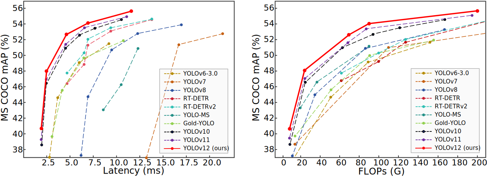

# [YOLOv12: Attention-Centric Real-Time Object Detector](https://arxiv.org/abs/2502.xxxxx)


Official PyTorch implementation of **YOLOv12**.

<p align="center">
   <br>
  Comparisons with others in terms of latency-accuracy (left) and FLOPs-accuracy (right) trade-offs.
</p>

[YOLOv12: Attention-Centric Real-Time Object Detector](https://arxiv.org/abs/2502.xxxxx).\
Yunjie Tian, Qixiang Ye, and David Doermann\
[](https://arxiv.org/abs/2502.xxxxx)

## UPDATES 🔥
- 2025/02/15: ! 


<details>
  <summary>
  <font size="+1">Abstract</font>
  </summary>
Enhancing the network architecture of the YOLO framework has been crucial for a long time but has focused on CNN-based improvements despite the proven superiority of attention mechanisms in modeling capabilities. This is because attention-based models cannot match the speed of CNN-based models. This paper proposes an attention-centric YOLO framework, namely YOLOv12, that matches the speed of previous CNN-based ones while harnessing the performance benefits of attention mechanisms.

YOLOv12 surpasses all popular real-time object detectors in accuracy with competitive speed. For example, YOLOv12-N achieves 40.6% mAP with an inference latency of 1.64 ms on a T4 GPU, outperforming advanced YOLOv10-N / YOLOv11-N by 2.1%/1.2% mAP with a comparable speed. This advantage extends to other model scales. YOLOv12 also surpasses end-to-end real-time detectors that improve DETR, such as RT-DETR / RT-DETRv2: YOLOv12-S beats RT-DETR-R18 / RT-DETRv2-R18 while running 42% faster, using only 36% of the computation and 45% of the parameters.
</details>


## Main Results
COCO

| Model                                                                                | size<br><sup>(pixels) | mAP<sup>val<br>50-95 | Speed<br><sup>T4 TensorRT10<br> | params<br><sup>(M) | FLOPs<br><sup>(G) |
| :----------------------------------------------------------------------------------- | :-------------------: | :-------------------:| :------------------------------:| :-----------------:| :---------------:|
| [YOLO12n](https://github.com/sunsmarterjie/yolov12/releases/download/v1.0/yolov12n.pt) | 640                   | 40.6                 | 1.64                            | 2.6                | 6.5               |
| [YOLO12s](https://github.com/sunsmarterjie/yolov12/releases/download/v1.0/yolov12s.pt) | 640                   | 48.0                 | 2.61                            | 9.3                | 21.4              |
| [YOLO12m](https://github.com/sunsmarterjie/yolov12/releases/download/v1.0/yolov12m.pt) | 640                   | 52.5                 | 4.86                            | 20.2               | 67.5              |
| [YOLO12l](https://github.com/sunsmarterjie/yolov12/releases/download/v1.0/yolov12l.pt) | 640                   | 53.7                 | 6.77                            | 26.4               | 88.9              |
| [YOLO12x](https://github.com/sunsmarterjie/yolov12/releases/download/v1.0/yolov12x.pt) | 640                   | 55.2                 | 11.79                           | 59.1               | 199.0             |

## Installation
```
wget https://github.com/Dao-AILab/flash-attention/releases/download/v2.7.3/flash_attn-2.7.3+cu11torch2.2cxx11abiFALSE-cp311-cp311-linux_x86_64.whl
conda create -n yolov12 python=3.11
source activate yolov12
pip install -r requirements.txt
pip install -e .
```

## Validation
[`yolov12n`]([https://github.com/sunsmarterjie/yolov12/releases/download/v1.0/yolov10n.pt)
[`yolov12s`]([https://github.com/sunsmarterjie/yolov12/releases/download/v1.0/yolov10s.pt)
[`yolov12m`]([https://github.com/sunsmarterjie/yolov12/releases/download/v1.0/yolov10m.pt)
[`yolov12l`]([https://github.com/sunsmarterjie/yolov12/releases/download/v1.0/yolov10l.pt)
[`yolov12x`]([https://github.com/sunsmarterjie/yolov12/releases/download/v1.0/yolov10x.pt)

```python
from ultralytics import YOLO

model = YOLO.from_pretrained('sunsmarterjie/yolov12{n/s/m/b/l/x}')
# or
# wget https://github.com/sunsmarterjie/yolov12/releases/download/v1.0/yolov12{n/s/m/l/x}.pt
model = YOLO('yolov12{n/s/m/b/l/x}.pt')

model.val(data='coco.yaml', batch=128)
```

## Training 
```python
from ultralytics import YOLO

model = YOLO('yolov12n.yaml')

# Train the model
results = model.train(
  data='coco.yaml',
  epochs=600, 
  batch=128, 
  imgsz=640,
  device="0,1,2,3",
)

# Evaluate model performance on the validation set
metrics = model.val()

# Perform object detection on an image
results = model("path/to/image.jpg")
results[0].show()

# Export the model to ONNX format
path = model.export(format="onnx")  # return path to exported model
```

## Finetuning
```python

# If you want to finetune the model with pretrained weights, you could load the 
# pretrained weights like below
# model = YOLO.from_pretrained('sunsmarterjie/yolov12{n/s/m/l/x}')
# or
# wget https://github.com/sunsmarterjie/yolov12/releases/download/v1.0/yolov12{n/s/m/l/x}.pt
# model = YOLO('yolov12{n/s/m/b/l/x}.pt')

```

## Prediction
```python
from ultralytics import YOLO

model = YOLO.from_pretrained('sunsmarterjie/yolov12{n/s/m/l/x}')
# or
# wget https://github.com/sunsmarterjie/yolov12/releases/download/v1.0/yolov12{n/s/m/l/x}.pt
model = YOLO('yolov12{n/s/m/b/l/x}.pt')

model.predict()
```

## Export
```python
from ultralytics import YOLO

model = YOLO.from_pretrained('sunsmarterjie/yolov12{n/s/m/l/x}')
# or
# wget https://github.com/sunsmarterjie/yolov12/releases/download/v1.0/yolov12{n/s/m/l/x}.pt
model = YOLOv10('yolov12{n/s/m/b/l/x}.pt')

model.export(...)
```

## Demo
```
python app.py
# Please visit http://127.0.0.1:7860
```


## Acknowledgement

The code base is based on [ultralytics](https://github.com/ultralytics/ultralytics). Thanks for their excellent work!

## Citation

```BibTeX
@article{tian2025yolov12,
  title={YOLOv12: Attention-Centric Real-Time Object Detectors},
  author={Tian, Yunjie and etc.},
  journal={arXiv preprint arXiv:2502.xxxxx},
  year={2025}
}
```

